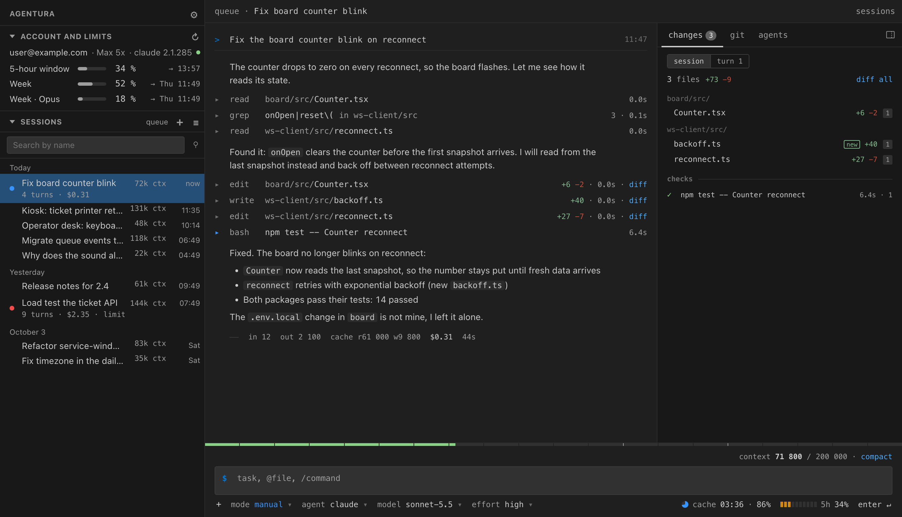
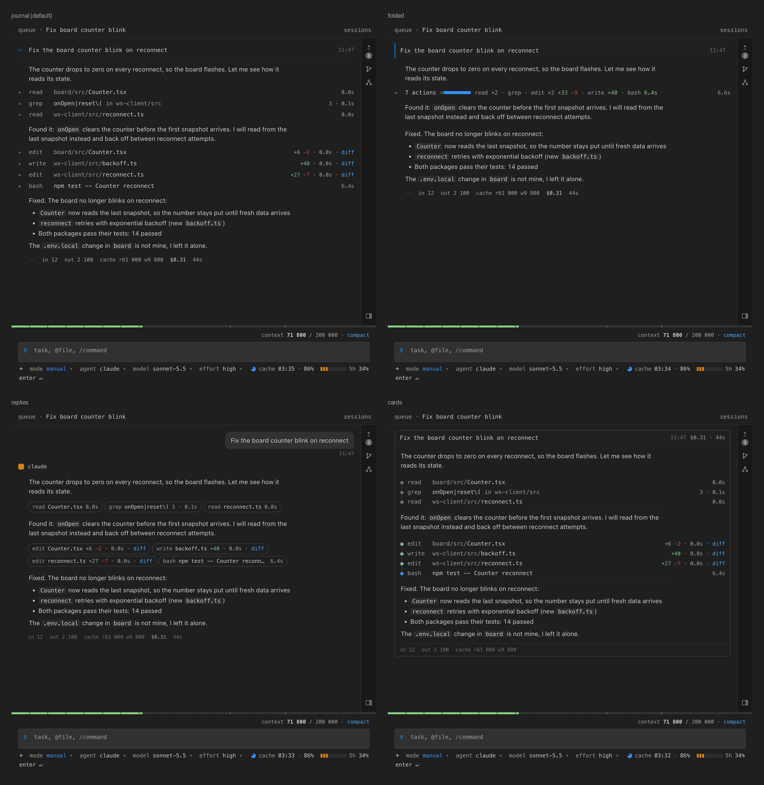
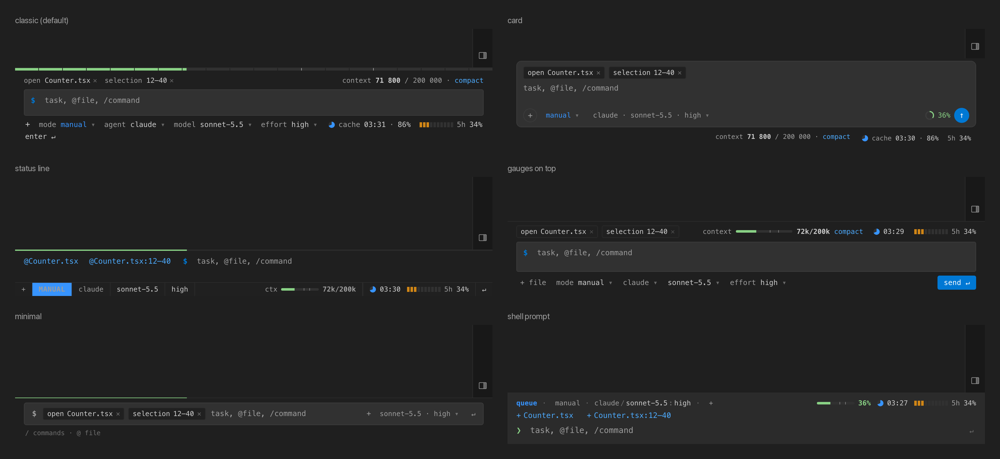
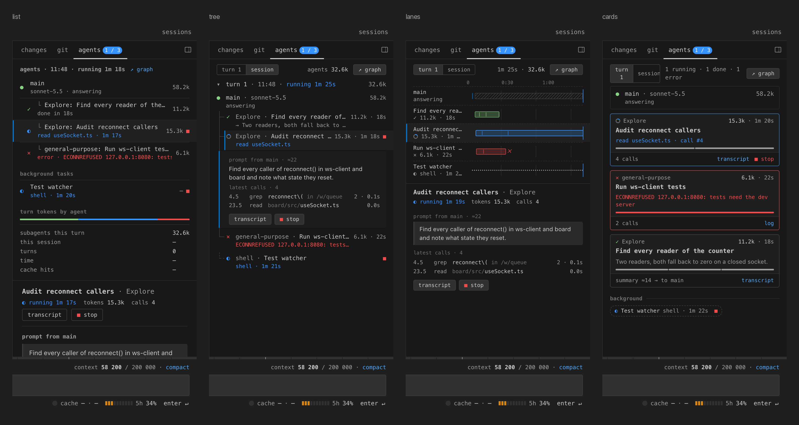
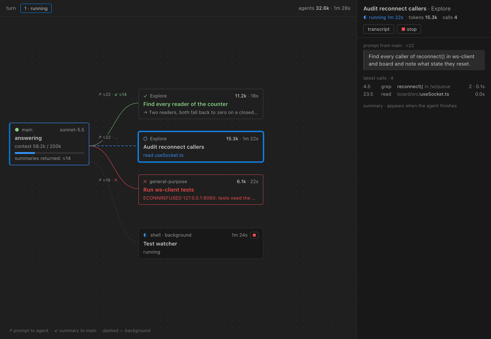
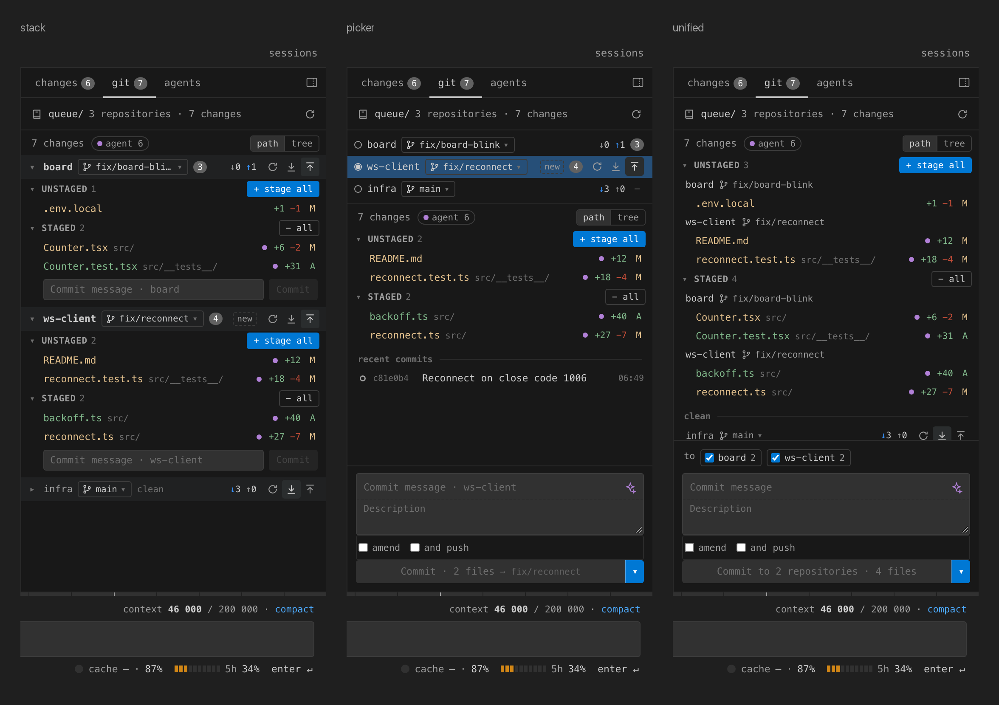
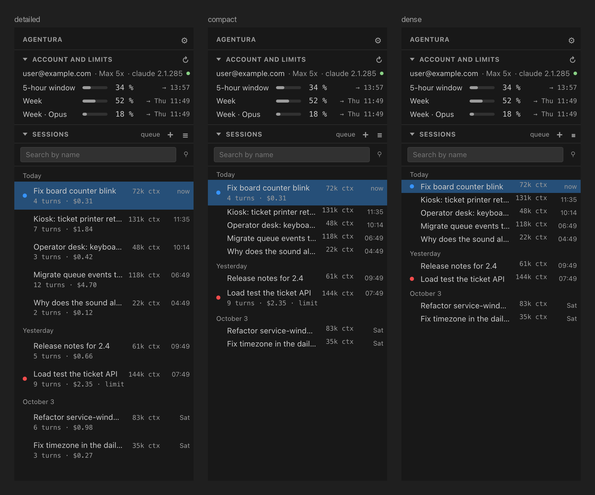
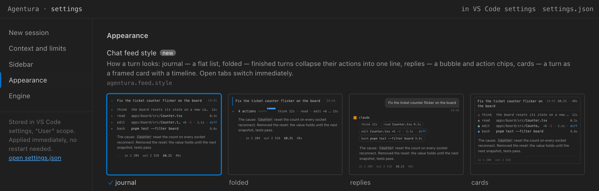

# Agentura

[English](README.md) · **Русский**

Чат с Claude для VS Code, который показывает то, что Claude Code держит за кадром: контекст в токенах, стоимость
хода, кэш, лимиты подписки, какие субагенты сейчас работают и что они правили. Движок — Claude Agent SDK, тот же, что
у Claude Code. Работает через установленный `claude` и его вход.

<picture>
  <source media="(prefers-color-scheme: light)" srcset="docs/images/hero-light.png">
  
</picture>

Личный проект, в Marketplace его нет. Ставится из `.vsix` (см. [Установка](#установка)). Скриншоты — с английским
интерфейсом, русский включается в `agentura.language`.

## Возможности

- **Чат во вкладках редактора.** Одна вкладка — одна сессия. `Cmd/Ctrl+Alt+A` открывает чат, `Cmd/Ctrl+Shift+N`
  начинает новую сессию.
- **Приборы у поля ввода.** Контекст с жёлтым и оранжевым порогом, стоимость и токены хода, TTL кэша и доля
  попаданий, лимиты за 5 часов и за 7 дней.
- **Разрешения.** Разрешение инструмента, вопросы агента и согласование плана (`ExitPlanMode`) приходят карточками в
  ленте. Правки открываются в штатном диффе.
- **Боковая панель.** Сессии проекта: поиск, продолжение, переименование. Над списком — аккаунт и лимиты.
- **Правая панель.**
  - `изменения` — файлы, которые тронула сессия.
  - `git` — рабочее дерево: индекс, коммит, push. Файлы, которые правил агент, помечены.
  - `агенты` — субагенты хода.
- **Граф агентов.** Открывается отдельной вкладкой редактора: кто кого запустил, какой промпт получил каждый агент и
  какой итог вернул, плюс его живые вызовы.
- **Вложения.** Скриншоты вставляются через `⌘V`. Файлы — через «+» или перетаскиванием с зажатым `⇧`. Текст и PDF
  уходят документами.
- **Вид.** Четыре стиля ленты, шесть раскладок поля ввода, пять видов агентов, три раскладки git, три плотности списка сессий, свои шрифты
  (встроенные, установленные или из Google Fonts), отдельный размер текста для ленты и для остального интерфейса.
- **Интерфейс на русском и английском.**

### Стили ленты

`agentura.feed.style`: `journal`, `folded`, `replies`, `cards`.



### Раскладки поля ввода

`agentura.composer.layout`: `classic`, `card`, `statusline`, `gauges`, `minimal`, `shell`. Клавиши и поведение везде
одинаковые, меняется только расстановка. Пока идёт ход, в поле — «↵ в очередь» и кнопка стопа.



### Агенты

`agentura.agents.view`: `list`, `tree`, `lanes`, `cards`. При `graph` карта агентов открывается вкладкой редактора.





### Вкладка git

`agentura.git.layout` задаёт раскладку, когда в рабочей папке несколько репозиториев:

- `stack` — у каждого репозитория своя секция.
- `picker` — список репозиториев сверху.
- `unified` — один общий список и один коммит в те репозитории, где стоит галочка.

Кнопка ✦ просит Sonnet написать сообщение коммита по диффу индекса.



### Боковая панель и настройки

`agentura.sessionList.view`: `detailed`, `compact`, `dense`. Все настройки есть и на вкладке настроек (⚙ в боковой
панели), с живыми превью.





## Установка

Нужны:

- VS Code 1.100 или новее.
- Claude Code 2.1.285 или новее, установленный и с выполненным входом (`claude`, затем `/login`).

Бинарник движка (200+ МБ) в расширение не входит. Расширение ищет системный `claude` в `PATH`, `~/.local/bin`,
`~/.claude/local` и Homebrew (на Windows — `claude.exe`). Другой путь задаётся в `agentura.claudeExecutable`.

```
code --install-extension agentura-0.4.0.vsix
```

Сборка из исходников:

```
npm ci
npm run check      # типы, линтер, юнит-тесты, сборка
npm run package    # agentura-0.4.0.vsix
```

## Движок Antigravity (экспериментально)

Вкладка чата может работать и на Antigravity CLI от Google (`agy`): выберите его в меню движка пустой вкладки или
задайте `agentura.defaultProvider = antigravity`. Внутри `agy` доступны Gemini, Claude и GPT.

Нужен установленный `agy` с выполненным входом (запустите `agy` один раз в терминале). Agentura ищет его в `PATH`,
`~/.local/bin` и Homebrew; другой путь — `agentura.antigravityExecutable` (⚙ → «Движок», там есть кнопка проверки).
Недельная квота (`agy -p "/usage"`, не чаще раза в 10 минут) показывается у поля ввода вместо лимитов Claude; если
вывод не разобрать — не показывается ничего.

Отличия от Claude:

- `agy` не умеет спрашивать разрешение на каждое действие. В режиме по умолчанию он отклоняет всё, что требует
  разрешения, а в ленте появляется карточка «agy отклонил: …» с кнопками «Разрешить правки и повторить» / «Разрешить
  всё и повторить». Более широкий режим перезапускает процесс; `bypassPermissions` — только явным выбором и при
  `agentura.allowBypassPermissions`.
- Stop убивает процесс `agy`; следующее сообщение поднимает его снова с той же беседой.
- Нет карточки плана, вопросов агента, `/compact`, субагентов, приборов контекста, кэша и стоимости; картинки и файлы
  не отправляются.
- История читается из локального хранилища `agy` (`~/.gemini/antigravity-cli`) — формат внутренний и может
  поменяться; тогда история сводится к тому, что видели вживую. Беседы открытой папки показываются в боковой панели
  и на пустом экране с меткой движка (возобновление и переименование работают; без `agy` их в списке нет).

## Настройки

Все настройки лежат под `agentura.*`. Менять их можно в Settings UI или на вкладке настроек. Эти настройки (таблица ниже) читаются только
из пользовательских настроек, чтобы клонированный репозиторий не мог поменять их через свой `.vscode/settings.json`:

| Настройка                         | По умолчанию | Что делает                                    |
| --------------------------------- | ------------ | --------------------------------------------- |
| `agentura.claudeExecutable`       | пусто        | Путь к `claude`; пусто — искать автоматически |
| `agentura.antigravityExecutable`  | пусто        | Путь к `agy`; пусто — искать автоматически    |
| `agentura.defaultProvider`        | `claude`     | Движок новых чатов                            |
| `agentura.allowBypassPermissions` | `false`      | Разрешить режим `bypassPermissions`           |

Если `agentura.defaultPermissionMode` равен `bypassPermissions`, а режим не разрешён, новые сессии стартуют в режиме
`manual`.

## Известные ограничения

- **Вход и ToS.** Anthropic не разрешает сторонним продуктам предлагать вход через claude.ai без одобрения. Своего
  входа у Agentura нет, используется вход CLI. Для личного использования это нормально, но для публикации нужно либо
  одобрение, либо API-ключи.
- **Лимиты** берутся из недокументированного эндпоинта (`/api/oauth/usage`) и могут сломаться. Тогда расширение
  откатывается на `rate_limit_event` движка, а в нём не сказано, к какому окну относится лимит.
- **Транскрипты** (`~/.claude/projects/*.jsonl`) — во внутреннем формате. Итоги сессий считаются по ним и могут
  разойтись после обновления CLI.
- **Стоимость** — оценка. Верный счёт — в подписке.
- **Каждая вкладка чата держит свой процесс `claude`.**
- **У субагентов** нет отдельной стоимости и токенов: движок их не сообщает. Размеры промпта и итога оцениваются по
  длине текста.
- **Проверено только на macOS arm64.** CI гоняется на macOS и Ubuntu, но руками на Windows и Linux расширением
  никто не пользовался.

## Разработка

```
npm run watch              # пересборка расширения и webview
npm test                   # юнит-тесты (vitest)
npm run test:integration   # интеграционный тест в скачанном VS Code
node scripts/vsix-verify.mjs [--live]    # проверка собранного .vsix; --live — один ход Haiku
node scripts/readme-shots/run.mjs        # перерисовать скриншоты выше (нужен npm run build)
```

Что где лежит:

- `src/agent` — адаптер SDK.
- `src/data` — сессии, лимиты, цены.
- `src/extension` — хост расширения.
- `src/webview` — интерфейс на Preact.
- `prototype/` — эталонная разметка.

`Agentura: Показать состояние (отладка)` открывает фикстуры состояний без движка. Скрипты `scripts/*-smoke.mjs`
гоняют живой движок и тратят токены. План и история решений — в `docs/roadmap/`.

## Лицензия

[MIT](LICENSE)
